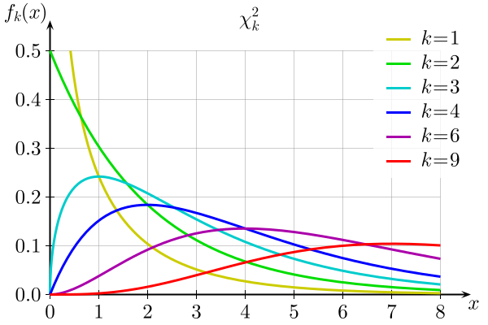

```{r, include=F}
library(tidyverse)
grad_app <- read.csv("https://stats.idre.ucla.edu/stat/data/binary.csv")

library(knitr)
hook_output <- knit_hooks$get("output")
knit_hooks$set(output = function(x, options) {
   lines <- options$output.lines
   if (is.null(lines)) {
     return(hook_output(x, options))  # pass to default hook
   }
   x <- unlist(strsplit(x, "\n"))
   more <- "..."
   if (length(lines)==1) {        # first n lines
     if (length(x) > lines) {
       # truncate the output, but add ....
       x <- c(head(x, lines), more)
     }
   } else {
     x <- c(more, x[lines], more)
   }
   # paste these lines together
   x <- paste(c(x, ""), collapse = "\n")
   hook_output(x, options)
 })
```

### Modeling grad admissions

.large[
**Data:** Grad application data
  * `admit`: accepted to grad school? (0 = no, 1 = yes)
  * `gre`: GRE score
  * `gpa`: undergrad GPA
  * `rank`: prestige of undergrad institution
  
.question[
We want to know whether there is a relationship between the prestige of a student's undergrad institution and the probability they are admitted to graduate school, *after accounting for their GRE score and GPA*.

How could we use hypothesis testing to investigate this research question?
]
]

---

### Modeling grad admissions

.large[
$$Admit_i \sim Bernoulli(\pi_i)$$
$$\log \left( \dfrac{\pi_i}{1 - \pi_i} \right) = \beta_0 + \beta_1 GRE_i + \beta_2 GPA_i + \beta_3 Rank2_i \\ \hspace{1cm} + \beta_4 Rank3_i + \beta_5 Rank4_i$$

.question[
How would I interpret the coefficients in this model?
]
]

---

### Hypotheses

.large[
$$Admit_i \sim Bernoulli(\pi_i)$$
$$\log \left( \dfrac{\pi_i}{1 - \pi_i} \right) = \beta_0 + \beta_1 GRE_i + \beta_2 GPA_i + \beta_3 Rank2_i \\ \hspace{1cm} + \beta_4 Rank3_i + \beta_5 Rank4_i$$

**Research question:** Is there a relationship between the prestige of a student's undergrad institution and the probability they are admitted to graduate school, after accounting for their GRE score and GPA?

.question[
What are my null and alternative hypotheses?
]
]

---

### Testing hypotheses

.large[
$$Admit_i \sim Bernoulli(\pi_i)$$
$$\log \left( \dfrac{\pi_i}{1 - \pi_i} \right) = \beta_0 + \beta_1 GRE_i + \beta_2 GPA_i + \beta_3 Rank2_i \\ \hspace{1cm} + \beta_4 Rank3_i + \beta_5 Rank4_i$$

**Hypotheses:**

$$H_0: \beta_3 = \beta_4 = \beta_5 = 0$$
$$H_A: \text{at least one of } \beta_3, \beta_4, \beta_5 \neq 0$$

.question[
How should we test these hypotheses and calculate a p-value?
]
]

---

### Class activity

.large[
[https://sta214-s23.github.io/class_activities/ca_lecture_8.html](https://sta214-s23.github.io/class_activities/ca_lecture_8.html)
]

---

### Class activity

.large[
**Full model:**

```{r, output.lines = 22:24}
m1 <- glm(admit ~ gre + gpa + as.factor(rank),
          data = grad_app, family = binomial)
summary(m1)
```
]

---

### Class activity

.large[
**Reduced model:**

```{r, output.lines = c(10:14, 18:20)}
m2 <- glm(admit ~ gre + gpa,
          data = grad_app, family = binomial)
summary(m2)
```
]

---

### Class activity

.large[
```{r, eval=F}
nsim <- 500
null_statistics <- rep(0, nsim)
for(i in 1:nsim){
  x <- grad_app$gre
  p <- exp(-0.77 + 0*x)/(1 + exp(-0.77 + 0*x))
  y <- rbinom(length(x), 1, p)
  m1 <- glm(y ~ x, family = binomial)
  null_statistics[i] <- m1$null.deviance - 
    m1$deviance
}
hist(null_statistics)
```

.question[
How do I modify this code to simulate from our reduced model?
]
]

---

### Class activity

.large[
```{r}
nsim <- 500
null_statistics <- rep(0, nsim)
for(i in 1:nsim){
  x1 <- grad_app$gre
  x2 <- grad_app$gpa
  x3 <- grad_app$rank
  p <- exp(-4.95 + 0.003*x1 + 0.755*x2)/(
    1 + exp(-4.95 + 0.003*x1 + 0.755*x2))
  y <- rbinom(length(x1), 1, p)
  
  m1 <- glm(y ~ x1 + x2 + as.factor(x3), 
            family = binomial)
  m2 <- glm(y ~ x1 + x2, 
            family = binomial)
  
  null_statistics[i] <- m2$deviance - m1$deviance
}
```
]

---

### Class activity

.large[
```{r, fig.align='center', fig.width=7, fig.height=5}
hist(null_statistics)
```
]

---

### Calculating a p-value

.large[
```{r, echo=F, fig.align='center', fig.width=7, fig.height=5}
hist(null_statistics)
```

```{r}
mean(null_statistics >= 21.82)
```
]

---

### Parametric bootstrapping

.large[
**Goal:** Test hypotheses comparing full and reduced models

**Step 1:** Fit the models and calculate a test statistic

**Step 2:** Repeat the following many times:

* Simulate from the reduced model
* Fit full and reduced models on simulated data
* Calculate a test statistic with the simulated data

**Step 3:** Compare observed test statistic (step 1) with simulated test statistics (step 3) to calculate p-value

.question[
Are there any disadvantages to this method?
]
]

---

### Examining the null distributions

.large[
```{r, echo=F, fig.align='center', fig.width=10, fig.height=4}
par(mfrow=c(1, 2))
null_statistics <- rchisq(1000, 1)
hist(null_statistics, main = "Testing a single parameter")

null_statistics <- rchisq(1000, 3)
hist(null_statistics, main="Testing multiple parameters")
```

.question[
What do you notice about these distributions?
]
]

---

### Examining the null distributions

.large[
```{r, echo=F, fig.align='center', fig.width=10, fig.height=4}
par(mfrow=c(1, 2))
null_statistics <- rchisq(1000, 1)
hist(null_statistics, main = "Testing a single parameter")

null_statistics <- rchisq(1000, 3)
hist(null_statistics, main="Testing multiple parameters")
```

.question[
Why do we always have $G \geq 0$?
]
]

---

### $\chi^2$ distribution

.large[
Under $H_0$, $G \sim \chi^2_{df_{\text{reduced}} - df_{\text{full}}}$

$\chi^2_k$ distribution: parameterized by degrees of freedom $k$
]

.center[

]

---

### Computing a p-value

.large[
$\log \left( \dfrac{\pi_i}{1 - \pi_i} \right) = \beta_0 + \beta_1 \text{GRE}_i$ 

$H_0: \beta_1 = 0 \hspace{1cm} H_A: \beta_1 \neq 0$

$G =$ deviance for reduced model - deviance for full model = 13.92 $\sim \chi^2_1$

```{r}
pchisq(13.92, df = 1, lower.tail=FALSE)
```
]

---

### Computing a p-value

.large[
$$\log \left( \dfrac{\pi_i}{1 - \pi_i} \right) = \beta_0 + \beta_1 GRE_i + \beta_2 GPA_i + \beta_3 Rank2_i \\ \hspace{1cm} + \beta_4 Rank3_i + \beta_5 Rank4_i$$

$$H_0: \beta_3 = \beta_4 = \beta_5 = 0$$
$$H_A: \text{at least one of } \beta_3, \beta_4, \beta_5 \neq 0$$

$G =$ deviance for reduced model - deviance for full model = 21.82

```{r, eval=F}
pchisq(..., df = ..., lower.tail=FALSE)
```
]

---

### Computing a p-value

.large[
$$\log \left( \dfrac{\pi_i}{1 - \pi_i} \right) = \beta_0 + \beta_1 GRE_i + \beta_2 GPA_i + \beta_3 Rank2_i \\ \hspace{1cm} + \beta_4 Rank3_i + \beta_5 Rank4_i$$

$$H_0: \beta_3 = \beta_4 = \beta_5 = 0$$
$$H_A: \text{at least one of } \beta_3, \beta_4, \beta_5 \neq 0$$

$G =$ deviance for reduced model - deviance for full model = 21.82

```{r}
pchisq(21.82, df = 3, lower.tail=FALSE)
```
]

---

### Likelihood ratio test for nested models

.large[
**Goal:** Compare full and reduced models

**Steps:**

* Calculate deviance for full and reduced models
* $G$ = deviance for reduced - deviance for full
* p-value: $G \sim \chi^2_{q}$
]

---

### Alternative: Wald tests for single parameters

.large[
$\log \left( \dfrac{\pi_i}{1 - \pi_i} \right) = \beta_0 + \beta_1 \text{GRE}_i$ 

**Hypotheses:**

<br/>

**Test statistic:**

$z =$
]

---

### Example

.large[
$\log \left( \dfrac{\pi_i}{1 - \pi_i} \right) = \beta_0 + \beta_1 \text{GRE}_i$ 

$H_0: \beta_1 = 0 \hspace{1cm} H_A: \beta_1 \neq 0$

```{r, echo=F, output.lines=10:14, highlight.output=c(4)}
grad_glm <- glm(admit ~ gre, data = grad_app, family = binomial)
summary(grad_glm)
```

$z =$
]

---

### Wald tests vs. likelihood ratio tests

.large[
.pull-left[
**Wald test**

* like t-tests
* test a single parameter
* some example hypotheses:
    * $H_0: \beta_1 = 0$ vs. $H_A: \beta_1 \neq 0$
    * $H_0: \beta_1 = 1$ vs. $H_A: \beta_1 > 1$
]

.pull-right[
**Likelihood ratio test**

* like nested F-tests
* test one or more parameters 
* some example hypotheses:
    * $H_0: \beta_1 = 0$ vs. $H_A: \beta_1 \neq 0$
]

p-values are different, because test statistics and distributions are different
]